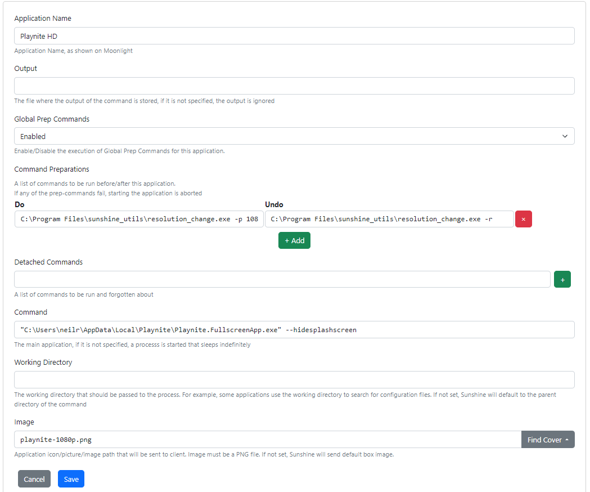

# Sunshine Utils

Sunshine Utils offers some useful utils for using with Sunshine / Moonlight / Playnite game streaming.

If this helps you please consider buying me a coffee as a token of appreciation.

<a href="https://www.buymeacoffee.com/githubfoxy82" target="_blank"></a>

1. `resolution_change` - a Windows utility to change the screen resolution before a gaming session and reset it after

## resolution_change

### Basic setup

1. Copy `resolution_change.exe` to a folder on your computer - I use `C:\Program Files\sunshine_utils`
2. In Sunshine Add a "Command Perparations" 
   1. In the "Do" box set the resolution you want e.g. `C:\Program Files\sunshine_utils\resolution_change.exe -p 1080p`
   2. In the "Undo" box to reset the resolution: `C:\Program Files\sunshine_utils\resolution_change.exe -r`
3. If using this with Playnite use the following in the "Command" for Playnite `"C:\<PLAYNITE_FOLDER>\Playnite.FullscreenApp.exe" --hidesplashscreen`



### Advanced Customization

```
usage: resolution_change.py [-h] [-l] [--width WIDTH] [--height HEIGHT]
                            [--refreshrate REFRESHRATE] [-d DISPLAY]
                            [--detach-other-monitors] [-p PRESET] [-r]
                            [--detach-monitor] [--wait WAIT] [--debug]

Changes monitor resolution

options:
  -h, --help            show this help message and exit
  -l, --list-displays   List current displays and exit
  --width WIDTH         Resolution Width
  --height HEIGHT       Resolution Height
  --refreshrate REFRESHRATE
                        The refresh rate in hertz
  -d DISPLAY, --display DISPLAY
                        Which display to use e.g. \\.\DISPLAY1 (defaults to
                        current primary)
  --detach-other-monitors
                        Detach other monitors except the named one
  -p PRESET, --preset PRESET
                        A preset to use can be one of: 4k, 2k, 1080p, 720p
  -r, --reset           Reset the resolution that a previous run has changed
  --detach-monitor      Detach the named display
  --wait WAIT           Time in seconds to wait after changing resolution
                        before exiting
  --debug               Enable debug mode so the program won't exit after
                        running
```

You can list out displays on your machine using `-l` or `--list-displays` this will show the current enabled displays

By default, the primary monitor's resolution will be changed. You can target resolution changes to a particular display using `-d` or `--display` e.g. `resolution_change.exe --width 1920 --height 1080 -d "\\.\DISPLAY2"`

You can detach all other monitors using `--detach-other-monitors`

Or you can just detach a named monitor using `--detact-monitor`

To return your settings back to normal call `--reset`

Not all of these have been tested please raise an issue if you find any.

## Development

This is a Windows based utilities so development needs to be done on Windows.

### Developer Dependencies
1. Install [Python 3.11](https://www.python.org/) for Windows, ensuring that you select "Add Python to PATH" during installation.
2. Install [pipenv](https://pypi.org/project/pipenv/) via `pip install pipenv`.
3. Install [git](https://git-scm.com/download/win) for windows

### Developer Setup
1. Open a command prompt
2. Clone this repo
3. In the repo directory run `python.exe -m venv venv`
4. To active the venv run `.\venv\Scripts\activate.bat` 
5. Run `pipenv install` to install the dependencies
6. To run locally `python resolution_change.py -p 1080p`
7. When finished to deactive the virtual env `.\venv\Scripts\deactivate.bat`

### To Build the exe
1. Activate the venv as above (and ensure you have installed the dependencies)
2. Run `build.bat`
3. You will find the exe in the dist folder

# Contributions

A big thank you goes out to [cgarst](https://github.com/cgarst). 
He wrote [gamestream_launchpad](https://github.com/cgarst/gamestream_launchpad) a lot
of the code in this repo uses his methods for changing the resolution. Also thanks to
[ventorvar](https://github.com/ventorvar) whose pull request on gamestream_launchpad helped
with multi monitor support.
